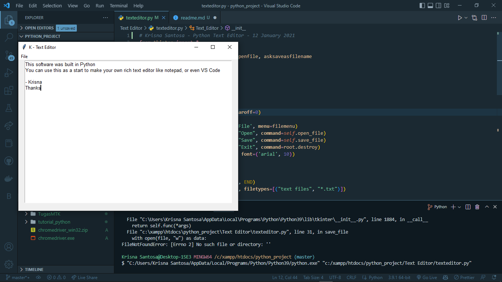
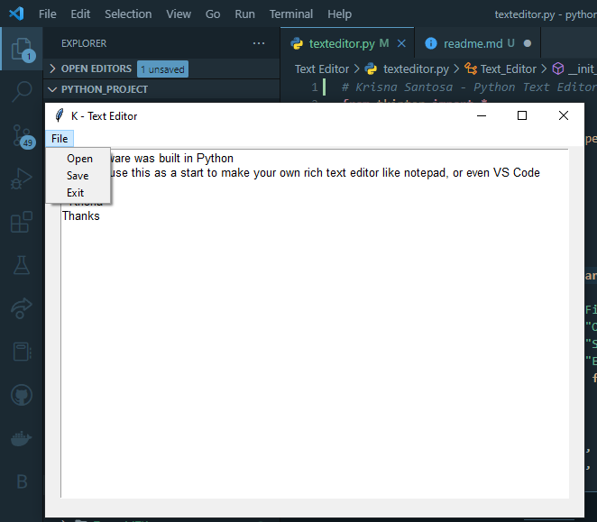

# K- Very Simple Text Editor

## Requirements

- Python 3.6 or higher
- tkinter

## Usage

- Clone the repository
- Install the requirements
- Run the script
- Enter the text
- Save the text

## Disclaimer

This is very simple text editor, you can use this to start building your own rich text editor.

## Result

- Editing Text
  
- File Options
  
